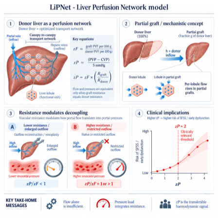

# LiPNet - Liver Perfusion Network model
### A perfusion-network model of the liver, and the predictions it makes about partial grafts


[](https://github.com/Danpc11/LiPNet/actions/workflows/tests.yml)
[](https://danpc11.github.io/LiPNet/)
[](https://doi.org/10.5281/zenodo.22861276)

## The model

The liver is treated as a transport network: a portal tree feeding a very large number of near-identical lobules, and a hepatic venous tree collecting from them. Minimising dissipated power at a fixed vascular maintenance cost `Σ m_e^b` gives, with no free parameters,

$$D^\* \propto F^{2}\,C^{-2/b}\,N^{(2-b)/b}\,L^{3},\qquad \tau_0=\sqrt{D^\*/C},\qquad \Delta P = f\,R$$

the optimum (a space-filling tree with one sinusoid per lobule), the wall-shear set-point it fixes, and the pressure drop across a single lobule.

A partial graft is the fraction `g` of that network that remains, perfused with `h` times the donor inflow, so each lobule receives `h/g` times its donor flow. Written in measurable quantities:

$$z_F=\frac{\text{graft PVF per }100\,\text{g}}{\text{donor PVF per }100\,\text{g}},\qquad
z_P=\frac{\text{PVP}-\text{CVP}}{5\ \text{mmHg}},\qquad
z_R=\frac{z_P}{z_F}=\frac{R_{\text{graft}}}{R_{\text{donor}}}$$

$$\boxed{\,z_P = z_F\,z_R\,}\qquad\text{pressure load}=\text{flow load}\times\text{resistance load}$$

All three loads equal 1 in a healthy donor, and the identity is the point of the model: flow and pressure are the same variable only while $z_R=1$. Any manoeuvre that enlarges the venous outflow lowers $z_R$, which is how a graft can carry three or four times the donor's flow without the pressure that would normally come with it. That product is the hepatic haemodynamic load, and the two clinical thresholds in use have been approximating it from opposite sides.

The model contains haemodynamics and nothing else: no recipient severity, no donor age, no steatosis. That is what makes it falsifiable.

<p align="center">
  
</p>

## Four predictions, and what the data say

Run `python src/predictions.py`; every number below comes from `results/predictions.json`.

**P1. The shear set-point must be invariant across mammals.** Portal pressure is 6–11 mmHg from mouse to human, so if the network is at its optimum, τ0 cannot scale with body mass. With the measured scalings (portal flow ~ M^0.77, portocentral distance ~ M^0.10), the predicted exponent of $\tau_0$ stays within [-0.077, +0.071] over the whole prespecified range of maintenance exponents, so the set-point is invariant as the model requires. The vascular mass is a weaker test: over the same range the predicted exponent spans 0.89–1.08, of which 18% falls inside the observed 0.80–0.92 for hepatic blood volume; no value of $b$ was chosen for agreeing with it. This prediction uses no transplant data at all.

**P2. Flow and pressure must separate when the outflow is enlarged.** Five published groups report both indices. The four whose outflow was reconstructed (middle hepatic vein included, venoplasty, left lobe with the middle and left hepatic vein trunk, splenectomy) have `zR` of 0.31, 0.55, 0.54 and 0.74, all below one as predicted (exact sign test on the four, p = 0.06; with the reported spread of pressures and flows propagated, each stays below one with probability 1.00). Their outcomes, reported separately from the mechanism, were 0–10% despite flows of three to four times the donor's. No flow threshold and no pressure threshold predicts this; the ratio does.

**P3. Within a cohort, outcome must rise with the pressure load.** The material is 17 series from 10 centres and 31 groups, 21 of them with a pressure load and 14 with a flow load. A slope needs two groups of the same outcome measured at different gradients, which 5 series provide for $z_P$ and 4 for $z_F$; 6 series report a single group and inform the level rather than the slope. Fitting the **same** model to each load, both restricted to the primary outcome so the arms are comparable:

| load | groups / series | events / patients | $\mu_\beta$ (95% CrI) | P($\mu_\beta>0$) |
|---|---|---|---|---|
| $z_P$, pressure | 7 / 3 | 76 / 573 | +1.56 (+0.35, +2.81) | 0.993 |
| $z_F$, flow | 8 / 4 | 48 / 321 | +0.86 (-0.58, +2.36) | 0.885 |

The pressure interval excludes zero and the flow interval does not, but that is not the same as showing the two loads differ: P($\mu_{z_P}>\mu_{z_F}$) is only 0.77, and the flow arm rests on much thinner material (48 events, median group of 10 patients, 2 groups with no events). Wang 2014 contributes to both. The decisive evidence that the loads are not interchangeable is P2, where the same grafts are measured on both scales at once. Adding the series whose groups are defined by a cut-off on the gradient (Yao 2018) gives 13 groups from 6 strata, $\mu_\beta$ +1.96 (+1.13, +2.81).

The primary analysis is a hierarchical binomial model with the pressure index centred within each study, so a study's level and its association are not traded off against each other:

```
E_gs ~ Binomial(n_gs, p_gs),  logit(p_gs) = alpha_s + beta_s (zP_gs − mean zP_s),  beta_s ~ N(mu_beta, tau_beta²)
```

NUTS, four chains (R-hat 1.001, minimum effective size 5114, 0 divergences, posterior predictive check 7/7). In the prespecified order: primary outcome, SFSS or early dysfunction, 7 groups from 3 studies, **mu_beta +1.55 (95% CrI +0.33 to +2.79), OR 4.70 per unit of zP, P(mu > 0) = 0.990**; secondary outcome, mortality or graft loss, +1.74 (+0.60, +2.86); both combined, +1.79 (+0.97, +2.64). Every within-study pair moves in the predicted direction, and the intercepts span almost four logits, which is what the model implies since it says nothing about what sets a centre's baseline.

Across 15 specifications (outcome definition, imputation, one Kyoto publication at a time, assumed CVP from 3 to 9 mmHg, three priors on tau, one stratum per centre instead of per publication) mu_beta stays between +0.92 and +1.93, always positive. The smallest value is the one that pools each centre's publications into a single stratum, +0.92 (+0.20, +1.65), which is the most conservative way to handle the overlapping Kyoto series. The prior on the between-study variation matters, as it must with five studies: HalfNormal(0.25) gives +1.60 with P(mu>0) = 0.998, HalfNormal(1.0) gives +1.46 (-0.07, +2.84) with 0.970. Propagating the uncertainty of the indices themselves, with the assumed CVP drawn per study over 3-9 mmHg and the posteriors pooled rather than their means, gives +1.74 (+0.89, +2.63).

Validation leaves out one centre, estimates the slope on the others and scores the held-out centre's within-cohort contrast with the conditional likelihood, which cancels its intercept, so nothing is fitted on its outcomes: the log-score gain over no association is +2.26 (Cairo), +2.74 (Fukuoka) and +8.40 (Kyoto), with the direction right in all three. A recovery simulation on the real sizes and gradients shows the limits of the design: with no true effect it never excludes zero, with mu = 1 it does about 60% of the time, with mu = 2 always, and tau_beta is not identifiable with five studies.

**P4. Thresholds from three different fields must coincide on this scale.** Clinically significant portal hypertension (HVPG ≥ 10 mmHg), the graft threshold (PVP 15 mmHg at CVP 5) and the limit above which a cirrhotic remnant is pushed after resection are all zP = 2; variceal bleeding (HVPG ≥ 12) is 2.4. Three thresholds derived independently, in cirrhosis, transplantation and hepatic surgery, land on the same normalised value.

## What this is not

An individual risk model. The level of risk is centre-specific: at a gradient near 5 mmHg the reported small-for-size rate is 13–17% in one series and 6% in another, and a third reports none at 12 mmHg. A single logistic curve fitted across centres is flat (slope 0.11, 95% CI −0.25 to 0.46), and the rank correlation of zP with outcome across series is weak (16 groups, ρ = 0.23, p = 0.399), as is that of flow per gram (12 groups, ρ = 0.27, p = 0.388). The transferable quantity is the effect of changing the gradient, not the baseline.

## Calculator

**https://danpc11.github.io/LiPNet/** — one HTML file, runs in the browser. Enter the current PVP and CVP, the pressure expected after the planned manoeuvre, and an anchor for the level (your cohort's overall rate and average gradient, your rate at the current gradient, or one of the fitted series). It returns the three loads, the odds ratio for the change and the absolute risks that anchor implies. The slope and its interval are the primary hierarchical estimate reported above; the per-series levels come from the stratified fit of the same data. A user-supplied anchor enters as logit p(z) = logit p_ref + mu_beta (z − z_ref), so the curve and its band pass through it.

To obtain your own baseline, `indices.baseline_from_rate(rate, mean_zP, beta)` gives `alpha = logit(rate) − beta·mean(zP)`, and `indices.recalibrate(outcomes, zP, beta)` fits the intercept on an audit with the slope held fixed. This is recalibration in the large, the first step of prediction-model updating (Steyerberg; Vergouwe et al., Stat Med 2017;36:4529; Janssen et al., Can J Anesth 2009;56:194).

## Contents

```
src/model/          the network model: 2D and 3D graphs, the optimum, closed-form scaling, allometric closure
src/predictions.py  tests P1-P4 against the data -> results/predictions.json
src/indices.py      zF, zP, stratified and hierarchical fits, internal-external validation, recalibration
src/plots.py        18 stand-alone plots, one file each
src/build_app.py    rebuilds the calculator from the fitted effect
data/series.tsv     31 groups from 17 series: raw values, provenance, centre, cohort, period, outflow, timing
sfss_calculator.html, index.html, tests/, run_all.sh
```

## Reproduce

```bash
pip install -r requirements.txt
./run_all.sh                       # indices, predictions, plots and calculator, about three minutes
python src/predictions.py          # the four predictions with their numbers
python src/plots.py predictions     # the four-panel summary figure
```

Model campaigns behind the cached tables (the optimum on 37–1478 lobules in 2D and 3D, the exhaustive certificate on seven lobules, the allometric closure) are in `src/model/` and listed, commented, in `run_all.sh`.

## Data

`data/series.tsv` holds raw values only; indices are recomputed by `src/indices.py`. Each `*_basis` column says where a value came from (`reported`, `derived`, `imputed`, `threshold`, `not applicable`), and the structural columns (`centre_id`, `cohort_id`, `recruitment_start/end`, `overlap_set`, `outflow`, `gradient_timing`, `gradient_sd`, `outcome_definition`, `outcome_horizon`, `modulation_strategy`) separate study, centre and cohort. Groups defined only by a cut-off, and the second partition of a cohort already counted, are excluded from the main analysis and reported in `results/sensitivity.tsv`.

Series: Troisi 2003, Troisi 2005, Ou 2010, Vasavada 2014, Alim 2016, Chan 2011, Yagi 2005, Yagi 2006, Wang 2014, Osman 2017, Ogura 2010, Yamada 2008, Uemura 2016, Yao 2018, Kanetkar 2017, Ishizaki 2012, Botha 2010.

## Limitations

P3 rests on aggregated group data: five series from four centres, 104 events, three of which report the primary outcome, with Kyoto series overlapping in time. Assumed CVP does not affect the slope (a constant shift within a study is absorbed by its intercept), but it does move where groups sit on the axis. Aggregated data allow the likelihood, the deviance and observed-to-expected ratios; they cannot give a c-statistic, an individual calibration curve, a Brier score or a decision curve. P1, P2 and P4 do not depend on that analysis. The calculator is a research tool, not a medical device.

## Publication

The article this repository accompanies is titled **Vascular resistance modulates portal flow–pressure decoupling in partial liver grafts** (in preparation). Until a preprint exists, cite the archived software.

## Citation and licence

`CITATION.cff`; until the preprint appears, cite the Zenodo record [10.5281/zenodo.22861276](https://doi.org/10.5281/zenodo.22861276). Code under [PolyForm Noncommercial 1.0.0](https://polyformproject.org/licenses/noncommercial/1.0.0); values in `data/` belong to the authors of the cited papers. Funded by DGAPA-PAPIIT IN234029 and SECIHTI CBF-2025-G-789.
